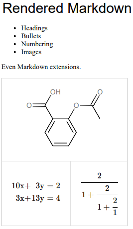

# </img> Print

[Marketplace page](https://marketplace.visualstudio.com/items?itemName=pdconsec.vscode-print)

[English version](https://github.com/PeterWone/vsc-print) by Peter Wone

[Chinese Version](https://github.com/kuriyamasss/vsc-print) by Kuriyamasss,中文版本由Kuriyamasss翻译

[ENGLISH](README.md) | [FRANCAISE](README.fra.md) | [DEUTSCH](README.deu.md) | [ESPAGNOLE](README.esp.md) | [中文CHINESE](README.zho.md) | [Add a language](how-to-add-a-language.md)

## Markdown and source code, styled for print

* Print source code
* Print Markdown fully rendered
* Supports remote workspaces

 

 

Source code gets line numbers and syntax colouring. Markdown is rendered with VS Code's preview rendering pipeline, so many Markdown extensions work with printing.

## Platform independent printing

Print-jobs are rendered as styled HTML and served from an embedded webserver. Your local web browser is launched to load the print-job and give you printing options like page orientation and margin size. So if you have a local browser that can print, and VS Code can launch it, you're in business.  

### Troubleshooting on first launch

* Nothing seems to happen &mdash; restart VS Code.
* Firefox browser is problematic. Install Chromium (or Chrome, Edge, Brave...) and either make it the default browser or configure the Print extension to use a specific browser (RTFM).
* Browser launches but no page loads &mdash; check networking permissions.
* Browser shows an error message about not finding a CSS file &mdash; you installed from a VSIX that wasn't prepared by us. Get the [official package](https://marketplace.visualstudio.com/items?itemName=pdconsec.vscode-print) and try again.

If something else is wrong, or you have an improvement idea, we invite you to log an issue on the GitHub repository.

## Classic user experience

The print icon on the toolbar prints the document in the active editor.

If you have a text selection that crosses at least one line-break you can right click and choose `Print` from the context menu to send just the selection to the printer. In the absence of a multi-line selection the entire document is printed. You can control the position of `Print` in this menu, or remove it altogether.

Or you can right-click on a file in the file explorer pane and choose Print from the context menu.

## Features

* Works on Mac, Linux and Windows
* Entirely local in operation, no dependence on cloud services (third party Markdown extensions may introduce remote dependencies)
* Syntax colouring in a wide range of familiar colour schemes 
* Optional line numbering
* Adjustable line spacing (1, 1.5, 2)
* Print a selection of code with line numbers matching the editor
* Specify a browser other than your default
* Markdown documents are rendered when you print them (or not, there's a setting)
* Works with Microsoft remote host extensions for SSH, WSL and Docker containers

## Requirements

* Start by making sure you can print a web page from your browser.
* Firefox is _not_ an ideal choice but if you prefer it as your default browser then you will be pleased to learn that you can you can configure printing to use a non-default browser &mdash; you can have it both ways.
* The user as which VS Code runs must be able to establish a listening socket.

## Reporting bugs

Raise an issue on the repository. 

For issues pertaining to rendered Markdown, attach a test document demonstrating the problem. Include supporting images and stylesheets. Use a zip file for samples that require a directory structure. 

Screen snaps of failed outcomes are always a good idea.

## Extension Settings

The Print extension is highly configurable. Settings can be modified by going to Code > Preferences > Settings > Extensions > Printing.

**A detailed breakdown of these settings can be found in [the manual](https://github.com/PeterWone/vsc-print/blob/master/manual.md).**

## Choice of browser

The browser used will affect your experience.  

### Recommended for printing

For best printing results, install a Chromium based browser. If you don't want to make this your default browser, take advantage of the alternate-browser settings. 

The following are known to work well.
* Brave
* Chromium
* Chrome
* Edge

### Not recommended for printing

* Firefox prints well enough but doesn't close the browser afterward. 
* Edge Classic is no longer supported.
* Internet Explorer is not supported.

## Known Issues

### Markdown extensions and remoting

To use Print with a remote host you must install it **on the remote host**. 

To get the benefit of a Markdown extension when printing a document from a remote host, the Markdown extension must be built with an `extensionKind` of `workspace` _and_ it must be installed to the remote host. Most such extensions are not built for `workspace` but can be trivially fixed by modifying their `package.json`. Unfortunately this manual patch is likely to be lost whenever the extension is updated so you should raise an issue with the author of extensions you patch.

### Spaces in paths

On Windows you cannot supply command-line options on the alternate browser path because we automatically put quotes around your path in case of spaces in file or folder names.  

On other platforms auto-quoting is not done and you must manually escape spaces in file and folder names.

Work around auto-quoting by creating a batch file in the same directory as the browser executable and use this to specify the options you require. For the browser path, supply the path to the batch file. Don't forget to pass through the URL parameter.

### Chrome and plugins
Chrome may retain your printer, paper size and margin selections between print jobs. Some Chrome command line options cause errors to be reported, even though printing succeeds. 

Some Chrome plugins interfere with print job styling. While it is possible to suppress plugins with `--disable-plugins` this doesn't work when there is already a running instance of Chrome. The `--incognito` switch suppresses plugins when there is a running instance, but has its own problems.

### Indirect Internet dependencies

The Math+Markdown extension (installs the KaTeX plugin) requires an internet connection for stylesheets and fonts. You must also configure a stylesheet reference. Details are in the manual.

## Release Notes

Added diagnostic logging controlled by log level setting.
